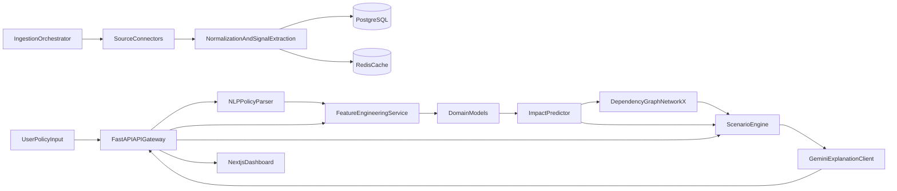

# Polaris: Policy Impact Intelligence System

Polaris is a production-oriented MVP scaffold for India-specific policy impact intelligence across markets, inflation, healthcare, trade, and commodities.

## System Architecture Diagram (Text)



## Folder Structure

- `backend/`: FastAPI app, data connectors, services, ML layer, tests.
- `frontend/`: Next.js dashboard scaffold.
- `infra/`: Docker compose for postgres, redis, backend, frontend.
- `scripts/`: sample data seeding scripts.
- `data/samples/`: unified sample dataset location used by connectors.

## Backend API Endpoints

- `GET /api/v1/health`
- `POST /api/v1/ingestion/run`
- `POST /api/v1/policy/parse`
- `POST /api/v1/prediction/impact`
- `POST /api/v1/scenario/simulate`
- `GET /api/v1/graph/dependencies`

## Quick Start

1. Seed sample files:

```bash
python scripts/seed_samples.py
```

2. Start services:

```bash
docker compose -f infra/docker-compose.yml up --build
```

3. Open:
- API docs: http://localhost:8000/docs
- Frontend: http://localhost:3000

## Example Requests

### Parse policy

```bash
curl -X POST http://localhost:8000/api/v1/policy/parse \
  -H "Content-Type: application/json" \
  -d '{"policy_text":"Cut repo rate by 25 bps to support growth amid supply risk."}'
```

### Predict impact

```bash
curl -X POST http://localhost:8000/api/v1/prediction/impact \
  -H "Content-Type: application/json" \
  -d '{"policy_text":"Increase import tariffs on fuel by 10%","context_overrides":{"inflation":5.4}}'
```

### Simulate scenarios

```bash
curl -X POST http://localhost:8000/api/v1/scenario/simulate \
  -H "Content-Type: application/json" \
  -d '{"policy_text":"Increase healthcare subsidy by 8%","shock_factor":0.2}'
```

## Notes

- NewsAPI, IMF, RBI, NITI, and Gemini connectors use fallbacks when keys or live feeds are unavailable.
- Policy parsing is hybrid: HuggingFace model path plus deterministic rule fallback.
- Domain models are seeded linear regressors for MVP contract stability; replace with XGBoost/LightGBM training in production.
- Current MVP is India-focused by default (`country: "India"` in prediction/scenario requests, India-filtered World Bank ingestion).

